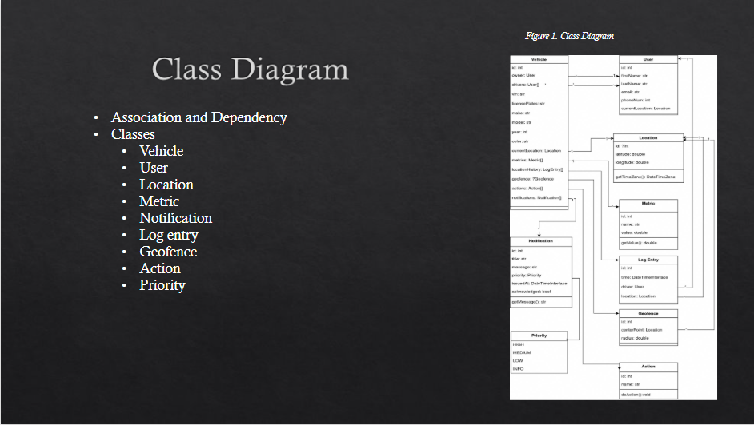

# SparkPlug: a Cloud-Based Vehicle Management Service
*Bits Please*  
*Julia Dewhurst, Joseph Melancon, Cade Wasti*  
*CSCI 463: Software Engineering*  
*16 May 2025*

**Abstract:** An application that will act as a vehicle management service is created 
that includes key features for a simple user experience. This project builds upon the 
term project from CSCI 363, in which an interface for this application was produced. 
This project emphasizes the integration of the front-end with the back-end development 
to yield a seamless experience for users. As the project progressed, charts and diagrams 
were created to aid with the comprehension and implementation of the project. These 
charts included class diagrams, use-case diagrams, activity diagrams, and state charts. 
The title of this application is SparkPlug. According to the parameters, SparkPlug will 
perform basic functionalities, including starting or stopping the vehicle’s engine, 
arming or disarming anti-theft alarms, displaying vehicle metrics, and monitoring the 
vehicle’s GPS location. The service will be accessible over Wi-Fi or cellular data, 
provide audio and visual feedback for notable events, and allow for intuitive 
management of drivers and vehicle permissions. The features and elements that make 
SparkPlug a simple, effective and efficient application will be further explored.

# 1. Introduction 

## 1.1 General Description of the Project

A remote management application for motor vehicles will be developed
targeting mobile devices. This application will provide various
functionalities that enable users to interact with a vehicle in manners
typical of other products in this field. The title chosen for this
implementation was titled SparkPlug, and developer goals include
creating an application that is smooth, intuitive, and modern.

## 1.2 The Assigned Specification

This project's guidelines dictate various functional requirements,
including Wi-Fi connectivity, display of client device time and cellular
strength, audio/visual feedback for events requiring user attention, and
configuration options for updating and editing user accounts and
vehicles. This system must also be capable of starting or stopping the
vehicle's engine, locking or unlocking doors, displaying vehicle
metrics, including but not limited to internal/external temperatures,
engine temperature, oil level, and fuel level, and activation or
deactivation of the vehicle's anti-theft alarm. Additional features that
were added to SparkPlug include notifications, day/night modes, and GPS
tracking with live updates.

## 1.3 Expected Deliverables

Throughout the semester, teams were required to provide reports for each
period of the semester to keep track of progress. These reports
contained diagrams and charts used for the conceptualization and
eventual implementation of the application.

### 1.3.1 Progress Report One Requirements

-   Class Diagram
-   Use Case Diagram
-   Gantt Chart
-   Interface Drawings

### 1.3.2 Progress Report Two Requirements

-   Revised Class Diagram
-   Use Case Descriptions (Two Use Cases)
-   Activity Diagrams (Two Scenarios)
-   State Chart (Two Scenarios)
-   Updated Interface Drawings

### 1.3.3 Progress Report One Requirements

-   Revised Class Diagram
-   Sequence Diagrams
-   System Dictionary

### 1.3.4 Final Report Requirements

-   Project Demonstration
-   Source code
-   Project report

# 2. Background

## 2.1 Theoretical Topics

There are guidelines and principles that developers must consider during
software engineering. These concepts are labeled as Software engineering
principles, safety-critical development guidelines and GUI principles.

The key software engineering principles are modularity, interfaces,
information hiding, incremental development, abstraction and generality.
Modularity is when a system can be broken into independent pieces to
simplify the system. Interfaces will be used for independent pieces
(modules) to interact with one another without revealing too much data.
This is related to information hiding, which is the process of hiding
the logic of the code from an outsider's perspective. This is done to
protect an application from attacks. Incremental development is the
process of building a system one step at a time. This allows for easier
documentation and if something goes wrong, it is easier to identify the
error. Abstraction focuses on high-level functionality and eliminates
extra noise. Finally, generality creates flexible and reusable systems.

Software engineers must be familiar with safety-critical development
guidelines, because the tools that are being programmed may be used in a
medical setting or another environment in which life is at stake. It is
important that software engineers follow these guidelines to prevent
life-threatening malfunctions from a programmed device. Developers must
assume errors will occur and implement error handling to fix errors that
do not result in the system crashing or a life-threatening mistake.
Developers should be aware of the potential of rare, yet severe risks of
the product they are working on. It's important to separate safety and
development roles to prioritize safety. There should be separate
departments to conduct extensive safety testing and analysis. It's
crucial that programs undergo a series of safety testing to ensure that
a product is not a risk to its customers.

Developers must also consider Graphical User Interface (GUI) principles.
GUI principles are crucial for product deployment since it focuses on
the user and how the user interacts with a product. A product that does
not follow GUI principles will not succeed since it is difficult for a
user to navigate. These GUI principles include focusing on a user's
tasks and needs, by clearly defining how the user interacts with the
system, a hierarchy of commands, and creating a clear, simple and
flexible layout with buttons and text boxes, etc as necessary. These
principles are critical for developers to follow because they prioritize
the user. A product's success depends on the customer and if a customer
has trouble navigating a system, they will not use the product. It is
imperative that developers consider GUI principles while developing a
product.

## 2.2 Description of the Models Used 

There were various models used throughout this project. These models
include UML class diagrams, use case diagrams, use case descriptions,
activity diagrams, state charts and sequence diagrams. The UML class
diagram represents how a system's classes, attributes, and methods
interact with each other. The UML Use Case Diagram displays the
functionality of a system. It shows the interactions between actors and
the system. Use Case Descriptions explain in detail each interaction an
actor has with the system. It describes the parameters, triggers and
what a failed and successful interaction looks like. An activity diagram
demonstrates the flow of data between actions, and more specifically
shows decisions and flow of operation within an environment. State chart
Diagrams portray how the state of an object changes in terms of a change
in state, transitions, events and actions. Finally, a sequence diagram
shows the relationships between objects over time. These models were
used throughout the project development to understand how the system
functions and how the team should approach implementation.

## 2.3 Object-Oriented Model-Driven Software Development

An object-oriented software model prioritizes the use of various models
to define the behavior of a software system before a system is
implemented. Software under this model is designed via collecting
objects, which are defined by a class with attributes and methods. Now
that these objects are identified, UML class diagrams and models such
as, state charts and sequence diagrams highlight important requirements
for a system. These models are then translated into code. This approach
offers an improved communication system between teams and clearly
depicts what a system should look like and eliminates misinterpretation.
This is a great example of code reusability and modularity.

# 3. The Project 

## 3.1 Description of Methodology applied

We used a combination of several software engineering principles in
conjunction with the UI design principles we learned in the previous UI
design class. We wanted to prioritize a focus on high-quality UI/UX
alongside maintaining fast and full application functionality. We did
this through extensive iterations of designs and a constant standard we
wanted the project to meet, being sure to implement functionality in
ordinance with the models we created for the task.

## 3.2 Description of Models developed

The development of our models was in and of itself a simple process. We
allocated the models based on who had a greater understanding of the
best ways to implement and/or describe the features of the application.
We believe our models were sufficient in creating a base template for
the development of the application itself but could have made them more
thorough and improved them to be even greater guides for our development
process.

## 3.3 Description of Graphical User Interface

Our graphical user interface was made to look as simple and clutter free
as possible while also being reactive to every input from the user. For
example, for every interactive component within the application, accent
colors are set to be in-line with the color of the user's vehicle.
Additionally, support for both light and dark themes is included,
allowing for comfortable useability regardless of the time of day. These
features, alongside many others, were implemented in manners such that
simplicity was not compromised, enabling users to navigate through
important and heavily used components within the application with ease.

## 3.4 Description of problems encountered and their resolution

Our team ran into a few difficulties throughout the development process.
The first was the question of what language and framework to develop the
application in. Following that, a second issue was getting the whole
group acclimated to the chosen technology stack. The latter issue was
addressed by allocating work proportional to the amount of experience
each individual had with the respective tools, of which PHP was most
relevant. We later ran into some issues with our sequence diagrams
regarding specific requirements. Upon being provided equally confusing
explanations when asking for additional clarification, we decided on
submitting both of our interpretations and accepting the potential point
loss. Our greatest challenges came near the end of the project, with a
final time crunch and a long meeting to get the application completed
being our final solution.

# 4. Conclusion 

## 4.1 Statement of what was learned

During this project, we were able to experience the process of software
development in a real-world application. Building off the previous
knowledge gained during User Interface Design, we were able to use
software engineering principles to build and implement a model-driven
application that more than fulfilled the requirements that were asked of
us and far exceeded our initial hopes. We placed an emphasis on
modularity and reusability, allowing for a program that could be as
efficient as we could make it at our level of knowledge.

## 4.2 Statement of what was useful vs not useful

We found that most of the models we created were very helpful during the
development of the application, as two-thirds of us were unfamiliar with
the language we were using and were able to rely on the models and
principles we had created to maintain a continuous level of efficiency.
If there was anything that we found not necessary, it would most likely
be our Gantt Chart. When we created the chart, we were unsure what our
workloads would be or how simple the development process would or
wouldn\'t be. As it turned out, we were under some heavy workloads
around when we planned to start the project, and as a result were
delayed in our initial implementation of the application.

## 4.3 Statement of what could be improved

If we were to continue with this program, we would most likely spend far
more time on additional features. Our collective experience with the
language and framework also grew exponentially than when we started, and
we're sure that we could do it even better and implement even more
features if we had another attempt. Additionally, we would have liked to
have had a greater understanding of some of the models, as the uses
and/or descriptions of some of the models seemed unnecessary or
redundant at certain times, only to be essential later in development.

# 5. References 

Pfleeger, Shari Lawrence, and Joanne M. Atlee. *Software Engineering:
Theory and Practice*. 4th ed., Dorling Kindersley, 2011.

# 6. Appendix

## 6.1 Presentation Slides from Project Presentation

## 6.2 Project Models

 

+-------------------+--------------------------------------------------+
| Use Case Title    | Add/Delete Vehicle                               |
+-------------------+--------------------------------------------------+
| Goal in Context   | The user will be able to add or delete a vehicle |
|                   | from their account                               |
+-------------------+--------------------------------------------------+
| Scope and Level   | Users will have an account and be able to        |
|                   |                                                  |
|                   | login and navigate to the add/delete vehicle     |
|                   | option to add or remove a vehicle                |
+-------------------+--------------------------------------------------+
| Preconditions     | A subscriber is logged in and selects the        |
|                   |                                                  |
|                   | option to add/remove vehicle                     |
+-------------------+--------------------------------------------------+
| Success/Failure   | Success: a logged in user successfully adds or   |
| End Condition     | removes a vehicle                                |
|                   |                                                  |
|                   | Failure: a logged in user is unable to add or    |
|                   |                                                  |
|                   | remove a vehicle                                 |
+-------------------+--------------------------------------------------+
| Primary/Secondary | Primary: user; Secondary: system                 |
| Actors            |                                                  |
+-------------------+--------------------------------------------------+
| Trigger           | Selects function to add or remove a vehicle      |
+-------------------+--------------------------------------------------+
| Description       | Users logs in and navigates to the function to   |
|                   | add or remove a vehicle                          |
+-------------------+--------------------------------------------------+

*Table 1: Vehicle addition/deletion use case description*

+-------------------+--------------------------------------------------+
| Use Case Title    | View Vehicle Metrics                             |
+-------------------+--------------------------------------------------+
| Goal in Context   | Display a selected vehicle's metrics             |
+-------------------+--------------------------------------------------+
| Scope and Level   | Users will have an account and be able to login  |
|                   | and navigate to the view vehicle metrics         |
|                   | function to display a selected vehicle's         |
|                   | metrics.                                         |
+-------------------+--------------------------------------------------+
| Preconditions     | A user is logged in and selects a vehicle        |
+-------------------+--------------------------------------------------+
| Success/Failure   | Success: a logged in user will be able to select |
| End Condition     | a vehicle and view its metrics                   |
|                   |                                                  |
|                   | Failure: a logged in user selects a vehicle and  |
|                   | selects the function to view its metrics and     |
|                   | nothing is displayed to the user.                |
+-------------------+--------------------------------------------------+
| Primary/Secondary | Primary: user; Secondary: system                 |
| Actors            |                                                  |
+-------------------+--------------------------------------------------+
| Trigger           | A user is logged in, one of their vehicles is    |
|                   | selected, and the function to view metrics is    |
|                   | selected.                                        |
+-------------------+--------------------------------------------------+
| Description       | User logs in and selects a vehicle's metrics to  |
|                   | view.                                            |
+-------------------+--------------------------------------------------+

*Table 2: Vehicle metrics viewing use case description*

## 6.3 System Dictionary

  -----------------------------------------------------------------------
  TERM              DEFINITION
  ----------------- -----------------------------------------------------
  Action            Something that can be done to a Vehicle. Examples
                    include locking/unlocking doors, opening trunk, etc.

  Driver            A User who is allowed to access and control a
                    Vehicle.

  Geofence          A 2-dimensional real-world space defined by a
                    Location and a radius.

  Location          A physical location provided by longitude/latitude
                    coordinates. Does not hold any area, but is rather a
                    single, 1-dimensional point.

  Log Entry         A datapoint describing the Location where a Vehicle
                    is, driven by a specific User, at a specific time.

  Metric            A specific statistic or measure of an attribute that
                    details a Vehicle's real-world state. Examples
                    include temperature, fuel level, etc.

  Notification      A push notification sent to all Drivers of a Vehicle.

  Owner             The User to whom the Vehicle is registered to.

  Priority          An indicator of the urgency of a Notification.

  User              An account in the system operated by an end user.

  Vehicle           A controllable, real-world vehicle.

  VIN               Vehicle Identification Number. Not used as the
                    identifying attribute for a Vehicle, but rather
                    refers to the identifier commonly used by motor
                    vehicle departments in the United States.
  -----------------------------------------------------------------------

*Table 3: System Dictionary*

## 6.4 User Interface Screens

 

 

 

## 6.5 Invoice of Work Distribution

+--------------+-------------------+---------------+
| **Member     | **Contributions** | **Contrib.    |
| Name**       |                   | Weight**      |
+--------------+-------------------+---------------+
| Cade Wasti   | Application       | 33.3%         |
|              | Backend           |               |
|              |                   |               |
|              | Models            |               |
|              |                   |               |
|              | Presentation      |               |
+--------------+-------------------+---------------+
| Julia        | Debugging         | 33.3%         |
| Dewhurst     |                   |               |
|              | Documentation     |               |
|              |                   |               |
|              | Models            |               |
+--------------+-------------------+---------------+
| Joseph       | Application       | 33.3%         |
| Melancon     | Frontend          |               |
|              |                   |               |
|              | Application       |               |
|              | Backend           |               |
|              |                   |               |
|              | Documentation     |               |
+--------------+-------------------+---------------+

*Table 4: Work Distribution Invoice*
